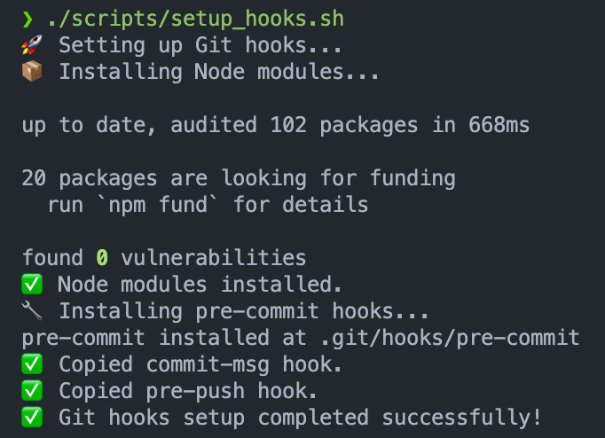
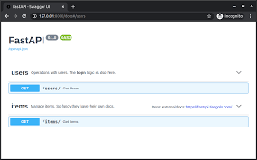

# Agents

## Table of Contents

- [Getting Started](#getting-started)
  - [Prerequisites](#prerequisites)
  - [Create a Virtual Environment](#create-a-virtual-environment)
  - [Install Dependencies](#install-dependencies)
  - [Install Git Hooks](#install-git-hooks)
- [Project Structure](#project-structure)
- [Development](#development)
  - [Running Locally](#running-locally)
- [Deployment](#deployment)
- [Contributing](#contributing)

## Getting Started <a id="getting-started"></a>

## Prerequisites <a id="prerequisites"></a>

- [Azure Developer CLI](https://aka.ms/azure-dev/install)
- [Python 3.11 or higher](https://www.python.org/downloads/)
  - Ensure you can run `python --version` from console. On Ubuntu, you might need to run `sudo apt install python-is-python3` to link `python` to `python3`.
- [Node.js 18+](https://nodejs.org/en/download/)
- [Git](https://git-scm.com/downloads)
- [DVC](https://dvc.org/doc/install)
- pre-commit — For macOS users, refer to the installation instructions [here](https://formulae.brew.sh/formula/pre-commit). For Windows users, refer [here](https://pre-commit.com/).
- [PowerShell 7+ (pwsh)](https://github.com/powershell/powershell) — For Windows users only.
  - Ensure you can run `pwsh.exe` from a PowerShell terminal. If this fails, you likely need to upgrade PowerShell.
- [uv](https://docs.astral.sh/uv/getting-started/installation/) — or other [alternatives](./docs/ALTERNATIVE_PYTHON_PACKAGE_MANAGERS.md).
  - [Bump My Version](https://callowayproject.github.io/bump-my-version/tutorials/getting-started/) - Recommended to install if you are already using uv. Otherwise, this is optional.

> [!NOTE]
> If you're using another Python package manager and would still like to use Bump My Version to manage the project's versioning, you may refer [here](https://pypi.org/project/bump-my-version/), [here](https://anaconda.org/conda-forge/bump-my-version) or [here](https://formulae.brew.sh/formula/bump-my-version).

### Create a Virtual Environment <a id="create-a-virtual-environment"></a>

**uv (Recommended)**

To manage our project dependencies, we are using uv which is an extremely fast Python package and project manager, written in Rust. For more information on how to get started with uv, please visit the [uv documentation](https://docs.astral.sh/uv/).

To create a virtual environment, run the following command:

```bash
uv venv
```

Once you have created a virtual environment, you may activate it.

On Linux or macOS, run the following command:

```bash
source .venv/bin/activate
```

On Windows, run:

```powershell
.venv/Scripts/activate
```

> [!NOTE]
> Check out the [Alternative Python Package and Project Managers](./docs/ALTERNATIVE_PYTHON_PACKAGE_MANAGERS.md) guide on alternative options if you do not wish to use uv.

### Install Dependencies <a id="install-dependencies"></a>

```bash
uv sync
```

### Install Git Hooks <a id="install-git-hooks"></a>

There are three main Git hooks used in this project:

- [`pre-push`](.githooks/pre-push): Ensures branches follow proper naming convention before pushing. See the [Git Branching Strategy](CONTRIBUTING.md#git-branching-strategy-) section for more details.
- [`commit-msg`](.githooks/commit-msg): Ensures commit messages follow our conventions. See the [Issue Tracking & Commit Message Conventions](CONTRIBUTING.md#issue-tracking--commit-message-conventions-) section for more details.
- [`pre-commit`](.pre-commit-config.yaml): Runs linting and formatting checks before committing. For more information, refer to the [pre-commit docs](https://pre-commit.com/). To see what hooks are used, refer to the [`.pre-commit-config.yaml`](.pre-commit-config.yaml) YAML file.

To set up Git hooks, run the following commands for Linux or Windows users respectively:

```bash
./scripts/setup_hooks.sh
```

or

```powershell
./scripts/setup_hooks.ps1
```

You should see the following upon successful installation:



_Successful Git Hooks Installation_

> [!TIP]
> You can manually run the command `pre-commit run --all-files` to lint and reformat your code. It is generally recommended to run the hooks against all of the files when working on your changes or fixes (usually `pre-commit` will only run on the changed files during commits).
>
> The `pre-commit` will run regardless if you forget to explicitly call it. Nonetheless, it is recommended to call it explicitly so you can make any necessary changes in advanced.

> [!NOTE]
> You should ensure that all `pre-commit` cases are satisfied before you push to GitHub (you should see that all have passed). If not, please debug accordingly or your pull request may be rejected and closed.
>
> The [`run-checks.yml`](.github/workflows/run-checks.yml) is a GitHub Action workflow that kicks off several GitHub Actions when a pull request is made. These actions check that your code have been properly linted and formatted before it is passed for review. Once all actions have passed and the PR approved, your changes will be merged to the `main` branch.

### Initialize Git Submodules <a id="initialize-git-submodules"></a>

This project uses Git submodules to manage external dependencies.

To initialize all submodules, run:

```bash
./scripts/set_submodules.sh
```

or on Windows:

```powershell
./scripts/set_submodules.ps1
```

To update all submodules, run:

```bash
./scripts/update_submodules.sh
```

or on Windows:

```powershell
./scripts/update_submodules.ps1
```

> [!IMPORTANT]
> For comprehensive submodule management and deployment workflows, please refer to the [Git Submodule Management & Deployment](CONTRIBUTING.md#git-submodule-management--deployment) section in our Contributing guide.

## Project Structure <a id="project-structure"></a>

For more information on our project structure, please refer to the [Project Structure](./docs/PROJECT_STRUCTURE.md) guide.

## Development <a id="development"></a>

For more information on development, you may find the following documentations useful:

- [Data Management](./docs/DATA_MANAGEMENT.md) - Instructions and guidelines on retrieving and managing version-controlled datasets using DVC integrated with Azure Blob Storage.
- [API Module](./docs/API.md) - High-level overview of the FastAPI backend database service and its architecture.
- [Frontend Module](./docs/FRONTEND.md) - High-level overview of the React frontend application and its components.
- [Agent Frameworks](./docs/AGENTS_FRAMEWORKS.md) - Overview of supported agent frameworks (LangGraph, OpenAI, Semantic Kernel).

### Running Locally <a id="running-locally"></a>

1. Ensure you're at the root of the project if not run `cd ..` to return to the root

> [!TIP]
> You may run `pwd` in your terminal to check your current working directory. Run `Get-Location` if you're using PowerShell.

2. Run the following command in your terminal:

   ```bash
   make run-server
   ```

   This will:

   - Install the `uv` Python package and project manager, and sync the dependencies.
   - Start the two FastAPI servers.
   - Install frontend dependencies and start the Angular development server.

   

3. Access the application:

   Once the script is running, you can visit:

   - **Main Server**: `http://127.0.0.1:8000` - Handles core application functionality.
   - **Agent Server**: `http://127.0.0.1:8001` - Dedicated to chat functionality.
   - **Frontend Server**: `http://127.0.0.1:4200`

4. To access the API endpoints, add `/docs` to the backend URLs:

   - **Main API Docs**: `http://127.0.0.1:8000/docs`.
   - **Agent API Docs**: `http://127.0.0.1:8001/docs`.

   

   For more information on FastAPI endpoints, please refer to the [API Endpoints](./docs/API_ENDPOINTS.md) guide.

## Deployment <a id="deployment"></a>

This project supports deployment to Azure using the Azure Developer CLI (azd). For detailed deployment instructions, please refer to the [Maintainers Step-by-Step Guide](./docs/MAINTAINERS_STEP_BY_STEP.md).

## Contributing <a id="contributing"></a>

Please refer to the [Contributing](CONTRIBUTING.md) guide for detailed guidelines on contributing and the process for submitting pull requests.
