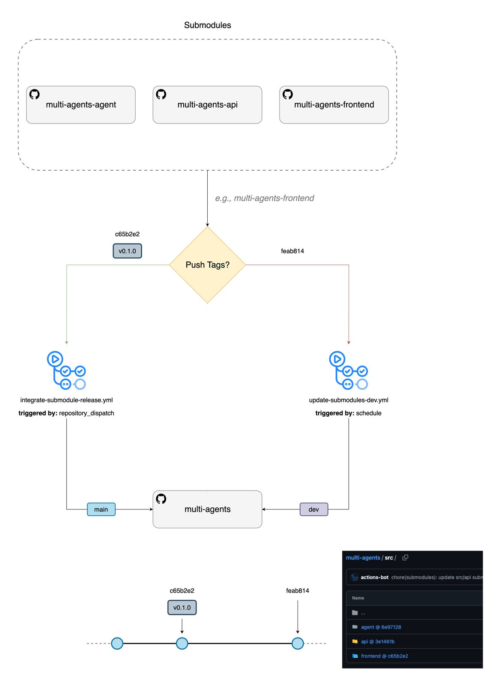

# Git Submodule Management & Deployment <a id="git-submodule-management--deployment"></a>

## Table of Contents <a id="table-of-contents"></a>

- [Submodule Basics](#submodule-basics)
- [Updated Multi-Repository Contribution Workflow](#updated-multi-repository-contribution-workflow)
  - [Architecture Overview](#architecture-overview)
  - [Component-Specific Workflows](#component-specific-workflows)
  - [Automated and Manual Triggers](#automated-and-manual-triggers)
- [Step-by-Step Deployment Scenarios](#step-by-step-deployment-scenarios)
  - [Scenario 1: Manual Main Repository Integration Process](#scenario-1-manual-main-repository-integration-process)
  - [Scenario 2: Pre-deployment Testing](#scenario-2-pre-deployment-testing)
  - [Scenario 3: Hotfixes](#scenario-3-hotfixes)
- [Best Practices](#best-practices)
  - [Submodule Version Management](#submodule-version-management)
  - [Deployment Automation](#deployment-automation)
- [Troubleshooting](#troubleshooting)
  - [Common Issues and Solutions](#common-issues-and-solutions)
  - [Benefits of Multi-Repository Approach](#benefits-of-multi-repository-approach)

## Submodule Basics <a id="submodule-basics"></a>

- **What are Git Submodules?**: Git submodules are repositories nested inside another Git repository. They allow you to include and manage external repositories or shared code within your own repository. Each submodule maintains its own Git history and can be developed independently while being referenced at specific commits from the parent repository.

- **Why Use Submodules?**: Submodules are useful for managing dependencies, shared libraries, or separating concerns within a project. They enable independent versioning and development of components. Common use cases include:

  - **Microservices Architecture**: Separate repositories for API, frontend, and backend services
  - **Shared Libraries**: Common utility code used across multiple projects
  - **Third-party Dependencies**: External libraries that need to be tracked at specific versions
  - **Component-based Development**: Independent teams working on different parts of a larger application

- **Our Project Focus**: This multi-agents project primarily leverages submodules for **microservices architecture** and **component-based development**:

  - **Microservices Architecture Implementation**:

    - `agents-api`: Backend REST API service handling health data, appointments, and business logic
    - `agents-frontend`: React-based web application providing the user interface
    - `agents-openai`: AI agent services powered by OpenAI Agents SDK
    - Each service can be developed, tested, deployed, and scaled independently
    - Services communicate through well-defined APIs, enabling different technology stacks per component
    - Allows for service-specific optimization (e.g., AI agents may require different compute resources than the web frontend)

  - **Component-based Development Benefits**:
    - **Independent Release Cycles**: Each team can release updates to their component without waiting for other teams to complete their work
    - **Parallel Development**: Multiple features can be developed simultaneously across different components without merge conflicts
    - **Focused Code Reviews**: Reviews are scoped to team expertise (e.g., Agents developers review agent logic, frontend developers review React components)
    - **Component Ownership**: Clear responsibility boundaries reduce coordination overhead and improve code quality

- **How Submodules Work**:

  - The parent repository stores a **pointer** (commit hash) to a specific commit in the submodule repository
  - Submodules appear as special entries in the parent's `.gitmodules` file and as directory references
  - Each submodule can be on different branches or tagged versions independently
  - Changes in submodules don't automatically update the parent repository

- **Best Practices**:

  - **Keep submodule references up to date in the main repository**: Regularly review and update submodule pointers to ensure you're using the latest stable versions. Use automated workflows or scheduled reviews to prevent submodules from becoming stale.

  - **Use tagged releases for submodules in production**: Always reference specific version tags (e.g., `v1.2.3`) rather than branch names in production deployments. This ensures reproducible builds and prevents unexpected changes from affecting production systems.

  - **Coordinate Releases**: When multiple submodules need to be updated together, coordinate the release process to ensure compatibility and proper testing.

  - **Backup Before Major Updates**: Create backup branches or tags before performing major submodule updates to enable quick rollbacks if issues arise.

## Updated Multi-Repository Contribution Workflow <a id="updated-multi-repository-contribution-workflow"></a>

This section explains how the contribution workflow has been adapted to work with dedicated component repositories while maintaining the same quality standards and processes.

- **Submodule Workflow Integration**:

  - **Development**: Work within individual submodule repositories using the same branching strategy (`feature/`, `bugfix/`, etc.)
  - **Integration**: Update submodule pointers in the main repository only after changes are merged and tagged in the submodule
  - **Deployment**: Use the main repository as the source of truth for which versions of each component should be deployed together

### Architecture Overview <a id="architecture-overview"></a>

- **Submodule Structure**:

  ```bash
  agents/                    # Main repository
  ├── .gitmodules                  # Submodule configuration
  ├── src/                         # Source code directory
  │   ├── api/                     # API submodule (agents-api)
  │   ├── agent/                   # Agent submodule (agents-openai)
  │   └── frontend/                # Frontend submodule (agents-frontend)
  ├── infra/                       # Bicep code for deployment
  └── azure.yaml                   # Main repo files
  ```

The main repository (`agents`) now serves as the **integration and deployment definition point**, containing:

- `azure.yaml` configuration
- Infrastructure-as-code files (bicep files)
- **Submodule pointers** (commit hashes) to specific versions of each component

### Component-Specific Workflows <a id="component-specific-workflows"></a>

Each component team (API, Agents, Frontend) works within their dedicated repository using the same contribution principles, but scoped to their component:

1. **Local Development**: Clone and work exclusively within the component repository (`agents-api`, `agents-openai`, `agents-frontend`)
2. **Feature Development**: Create `feature/` or `bugfix/` branches off `staging` in the component repository
3. **Pull Requests**: Create PRs from feature branch to `staging` in the component repository
4. **Code Review**: Reviewer reviews, approves, and squashes & merges into `staging`
5. **Weekly Releases**:
   - Reviewer creates a release PR from `staging` to `main` in the component repository
   - After approval, merge the release into `main` in the component repository
   - **Tag the merge commit** on `main` (e.g., `v1.2.0`)

Each team maintains:

- Independent release cycles with semantic versioning
- Own staging/main branch protection and review requirements
- Component-specific feature development and testing

### Automated and Manual Triggers <a id="automated-and-manual-triggers"></a>



Our main repository includes GitHub Actions workflows that support both scheduled submodule updates and manual deployment triggers with comprehensive configuration options.

**Submodule Update Workflows:**

We have multiple workflows for keeping submodules synchronized:

1. **Scheduled Update Submodules (Main)** - Updates submodules on the main branch
2. **Scheduled Update Submodules (Dev)** - Updates submodules on development branches (staging)
3. **Integrate Submodule Release** - Automatically integrates tagged releases from submodule repositories

**Automated Trigger Workflow:**

The **Integrate Submodule Release** workflow will be triggered automatically when submodule repositories create new releases:

- **Automatic Trigger**: Activated via `repository_dispatch` events when submodule repositories publish new tagged releases
- **Manual Trigger**: Can be manually executed with specific submodule path and tag parameters
- **Functionality**:
  - Checks out the main repository
  - Updates the specified submodule to the exact tagged version
  - Commits and pushes the submodule pointer update to the main repository

The **Scheduled Update Submodules** workflows provide automated maintenance of submodule references:

- **Automatic Trigger**: Both Main and Dev workflows are triggered by cron job scheduled for 12:00 AM UTC every Friday
- **Main Branch Workflow**: Updates submodule pointers on the main branch to track the latest commits from their respective main branches
- **Dev Branch Workflow**: Updates submodule pointers on development branches (typically staging) to track the latest commits from their respective development branches
- **Functionality**:
  - Automatically checks for new commits in tracked submodule branches
  - Updates submodule references to point to the latest commits
  - Commits and pushes changes if updates are detected

**Manual Trigger Workflow:**

The GitHub Actions workflows can be triggered manually with different configurations:

1. **Main Branch Updates**: Manual trigger for immediate submodule updates on main
2. **Development Branch Updates**:
   - Matrix-based updates for all configured branches (staging)
   - Targeted updates for specific branches via input parameter
3. **Deployment Workflows**: Manual deployment triggers with environment selection
4. **Submodule Integration**: Manual integration of specific submodule releases using the integrate workflow

**How to Manually Trigger GitHub Actions Workflows:**

GitHub Actions workflows configured with `workflow_dispatch` can be triggered manually from the GitHub web interface. Here's how:

1. **Navigate to the Actions Tab:**

   - Go to your repository on GitHub
   - Click on the **"Actions"** tab at the top of the repository page
   - You'll see a list of all workflows in your repository

2. **Select the Workflow:**

   - From the left sidebar, click on the specific workflow you want to trigger
   - Common workflows in our repository:
     - `Scheduled Update Submodules (Main)`
     - `Scheduled Update Submodules (Dev)`
     - `Integrate Submodule Release Tag`

3. **Trigger the Workflow:**

   - Click the **"Run workflow"** dropdown button (usually located on the right side)
   - This will open a form with the workflow inputs (if any are configured)

4. **Configure Workflow Inputs:**

   - Select the branch you want to run the workflow on (`main` or `staging`)
   - Fill in any required or optional input parameters
   - Review your selections before proceeding

5. **Execute the Workflow:**
   - Click the green **"Run workflow"** button to start the execution
   - The workflow will appear in the workflow runs list with a status indicator

**Example: Manual Submodule Update Trigger**

For submodule update workflows:

- **Branch**: Select the branch to update (usually `main` or `staging`)
- **Target Branch** (if applicable): Specify which development branch to update
- **Force Update**: Option to force update even if no changes detected

**Example: Manual Submodule Integration Trigger**

For the integrate submodule release workflow:

- **submodule_path**: Enter the path to the submodule (e.g., `src/api` for the API service, `src/frontend` for the frontend application)
- **tag**: Enter the specific version tag you want to integrate (e.g., `v1.2.0`)

## Step-by-step Deployment Scenarios <a id="step-by-step-deployment-scenarios"></a>

### Scenario 1: Manual Main Repository Integration Process <a id="scenario-1-manual-main-repository-integration-process"></a>

**Situation**: Manual integration process for updating submodule pointers in the main repository.

The main repository workflow includes an additional **integration step** performed within the main repository to update **submodule pointers**.

An administrator or release manager manually runs `git submodule update --remote` (and associated commands) in the main repository on a weekly basis. This is a perfectly reasonable interim solution that aligns well with our existing release cadence.

**Prerequisites:**

- Ensure weekly release PRs (`staging` → `main`) have been successfully merged in all relevant submodule repositories (`agents-api`, `agents-openai`, `agents-frontend`)
- All component teams have completed their tagging process

**Executor:** Administrator or designated release manager
**Timing:** After all submodule releases are complete for the week

**Step-by-Step Process:**

1. **Navigate to Main Repository:**

   ```bash
   cd /path/to/multi-agents
   ```

2. **Checkout Target Branch:**

   ```bash
   git checkout main
   ```

3. **Ensure Main Repository is Up-to-Date:**

   ```bash
   git pull origin main
   ```

4. **Update Submodule Pointers:**

   ```bash
   git submodule update --remote --init --recursive
   # --remote: Fetches latest from submodule's remote tracked branch
   # --init: Initializes any new submodules if necessary
   # --recursive: Handles nested submodules (if any)
   ```

   Alternatively, you can use our provided scripts:

   ```bash
   # For updating to latest remote versions
   ./scripts/update_remote_submodules.sh

   # Or on Windows
   ./scripts/update_remote_submodules.ps1

   # For updating to committed versions (local)
   ./scripts/update_submodules.sh

   # Or on Windows
   ./scripts/update_submodules.ps1
   ```

> [!NOTE]
> This assumes submodules in `.gitmodules` are configured to track the `main` branch. If they track `staging` or another branch, this command updates to the latest of that branch. Ensure they track `main` if that's your release branch.

5. **Check Status:**

   ```bash
   git status
   ```

   Expected output:

   ```bash
   On branch main
   Your branch is up to date with 'origin/main'.
   Changes not staged for commit:
     modified: multi-agents-api (new commits)
     modified: multi-agents-agents (new commits)
     modified: multi-agents-frontend (new commits)

   no changes added to commit (use "git add" and/or "git commit -a")
   ```

6. **Stage the Updates:**

   ```bash
   git add src/api src/agent src/frontend
   ```

7. **Commit the Updates:**

   ```bash
   git commit -m "chore(release): update submodules to latest main branch commits"
   ```

8. **Push the Main Repository:**

   ```bash
   git push origin main
   ```

9. **(Optional but Recommended) Tag the Main Repository:**

   ```bash
   # For semantic versioning
   git tag app-v1.5.0
   git push origin app-v1.5.0
   ```

10. **Deploy to Azure:**

    ```bash
    azd up
    ```

> [!IMPORTANT]
>
> **ALWAYS** use LATEST VERSIONED TAGGED submodules for production deployments. Never use branch references or untagged commits in production environments.

### Scenario 2: Pre-deployment Testing <a id="scenario-2-pre-deployment-testing"></a>

**Situation**: You have changes in the staging branch of a submodule that you want to test in a deployed environment before creating a release to main. This allows you to validate the changes work correctly in a real deployment scenario.

**Option A: Testing with Staging Branch (Recommended)**

```bash
# In the main repository, create a testing branch
git checkout -b test/staging-deployment

# Update specific submodule to staging branch
cd src/api  # or whichever submodule you want to test
git fetch origin
git checkout staging
git pull origin staging
cd ../..

# Commit the submodule update pointing to staging
git add src/api
git commit -m "test: update api submodule to staging for deployment testing"

# Push testing branch (optional, for team visibility)
git push origin test/staging-deployment

# Deploy to a test environment
azd up --environment rg-agents-test
```

**Option B: Testing with Specific Staging Commit**

```bash
# Create testing branch in main repository
git checkout -b test/api-staging-commit-abc123

# Update submodule to specific staging commit
cd src/api
git fetch origin
git checkout abc123def  # specific commit hash from staging
cd ../..

# Commit the submodule update
git add src/api
git commit -m "test: update api submodule to staging commit abc123def for testing"

# Deploy for testing
azd up --environment rg-agents-test
```

**Option C: Testing Multiple Submodules on Staging**

```bash
# Create testing branch
git checkout -b test/full-staging-deployment

# Update all submodules to their staging branches
git submodule foreach '
  git fetch origin
  git checkout staging
  git pull origin staging
'

# Commit all submodule updates
git add .
git commit -m "test: update all submodules to staging for integration testing"

# Deploy comprehensive test
azd up --environment rg-agents-test
```

**After Testing Process:**

```bash
# If tests pass and you're ready to release
# Go to each submodule and create release PR: staging → main

# Clean up testing branch
git branch -D test/<test-branch-name>

# If you have pushed to remote main repo
git push origin --delete <test-branch-name>
```

### Scenario 3: Hotfixes <a id="scenario-3-hotfixes"></a>

**Situation**: Critical issues requiring immediate fixes in production.

<!-- TODO: Add comprehensive hotfix procedures -->

## Best Practices <a id="best-practices"></a>

### Submodule Version Management <a id="submodule-version-management"></a>

1. **Always Use Tagged Versions in Production**

   - Never deploy untagged commits to production
   - Use semantic versioning for submodule tags
   - Document breaking changes in tag descriptions

2. **Regular Submodule Updates**

   - Schedule regular reviews of submodule versions
   - Test submodule updates in staging environments first
   - Maintain compatibility matrices between submodules

3. **Version Pinning Strategy**

   ```bash
   # Good: Specific tagged version
   git checkout v1.2.0

   # Avoid: Branch references in production
   git checkout main
   ```

### Deployment Automation <a id="deployment-automation"></a>

1. **Multi-Stage Validation**

   - Validate submodule versions before deployment
   - Run comprehensive tests in staging
   - Implement health checks and monitoring

2. **Rollback Preparedness**

   - Always create backups before deployment
   - Test rollback procedures regularly
   - Document emergency procedures

3. **Environment Consistency**
   - Use the same submodule versions across environments
   - Automate environment setup and configuration
   - Implement infrastructure as code

## Troubleshooting <a id="troubleshooting"></a>

### Common Issues and Solutions <a id="common-issues-and-solutions"></a>

**Issue: Submodule Not Updating**

```bash
# Force update
git submodule update --init --recursive --force

# Or reset submodule
git submodule deinit path/to/submodule
git rm path/to/submodule
git submodule add <url> path/to/submodule
```

**Issue: Detached HEAD in Submodule**

```bash
# If you want to stay on the committed version (normal for submodules)
# No action needed

# If you want to move to a branch
git checkout main
cd ..
git add submodule
git commit -m "chore: update submodule to main branch"
```

**Issue: Merge Conflicts in Submodule References**

```bash
# Check which versions are conflicting
git diff

# Choose the correct version
git add submodule
git commit -m "resolve: submodule merge conflict"

# Or use specific resolution
git checkout --ours submodule  # Use your version
git checkout --theirs submodule  # Use their version
```

**Quick Production Hotfix:**

```bash
# Create hotfix branch
git checkout -b hotfix/critical-fix

# Fix the issue in submodule
cd submodule
git checkout v1.2.1  # Known good version
cd ..

# Commit and deploy
git add submodule
git commit -m "hotfix: revert submodule to v1.2.1"
git push origin hotfix/critical-fix

```

### Benefits of Multi-Repository Approach <a id="benefits-of-multi-repository-approach"></a>

1. **Team Autonomy**: Each component team can work independently with their own release cycles
2. **Focused Reviews**: Code reviews are scoped to relevant team expertise
3. **Parallel Development**: Teams can develop features simultaneously without conflicts
4. **Component Isolation**: Issues in one component don't block development in others
5. **Granular Versioning**: Each component has its own semantic versioning
6. **Selective Deployment**: Deploy only changed components if needed
