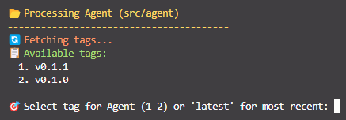
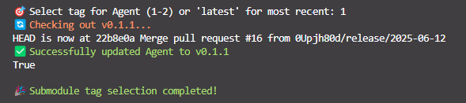
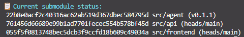

# Maintainers Step-by-Step Guide

This guide provides comprehensive instructions for project maintainers covering deployment, maintenance, troubleshooting, and advanced workflows for the Multi-Agents application. As a maintainer, you are responsible for ensuring stable releases and managing deployments across different environments.

## Understanding Deployment Strategies

Before diving into the deployment process, it's crucial to understand our two distinct deployment strategies and when to use each:

- **Production Deployment**: Uses tagged releases from submodule repositories. This is for stable, tested code that's ready for end users.
- **Development Deployment**: Uses latest commits from staging branches. This is for testing new features and changes before they're released.

> [!IMPORTANT]
>
> **Never deploy untested code to production.** Always ensure that development deployments have been thoroughly tested before promoting changes to production.

## Local Development Updates

### Update Local Submodules to Committed Versions

Before making any deployment decisions, you need to ensure your local environment reflects the current state of the repository. This step synchronizes your local submodules with the exact commits recorded in the main repository.

> [!NOTE]
>
> **Why this matters**: Submodules can drift from their recorded commits if you've been doing local development or testing. This step ensures you're working with the exact versions that are officially tracked.

```bash
# For updating to committed versions (local)
./scripts/update_local_submodules.sh

# Or on Windows
./scripts/update_local_submodules.ps1
```

**What this does**: These scripts checkout the exact commit SHA that's recorded for each submodule in the main repository. This ensures consistency between your local environment and what's officially tracked.

## Production Deployment (Main Environment)

Production deployments are the most critical part of your role as a maintainer. These deployments affect real users, so they require careful coordination and validation.

**Prerequisites for production deployment:**

Before you can perform a production deployment, ensure the following conditions are met:

- **All weekly release PRs are merged**: Verify that `staging` → `main` PRs have been successfully merged in all relevant submodule repositories (`agents-api`, `agents-openai`, `agents-frontend`)
- **Tagging is complete**: All component teams have completed their tagging process with proper semantic versioning (e.g., `v1.2.3`, `v2.0.1`)
- **Testing is done**: Changes have been thoroughly tested in the development environment

- **Executor:** Administrator or designated release manager
- **Timing:** After all submodule releases are complete for the week (typically Friday afternoons or designated release windows)

### Production Step 1: Navigate to Main Repository

```bash
cd /path/to/agents
```

### Production Step 2: Checkout Target Branch

Switch to the main branch, which represents your production-ready code. The main branch should always contain stable, tested code.

```bash
git checkout main
```

**What happens here**: Git switches your working directory to reflect the main branch. Any uncommitted changes in other branches won't affect this process, but you should have a clean working directory.

### Production Step 3: Ensure Main Repository is Up-to-Date

Pull the latest changes from the remote main branch. This ensures you're not missing any recent updates that other maintainers might have made.

```bash
git pull origin main
```

### Production Step 4: Update Submodules to Latest Release Tags

This is the core step where you select which versions of each submodule to include in your production deployment. Use the interactive script to carefully choose the appropriate tags.

**Select Specific Tags (Interactive)**

```bash
# For selecting specific tag versions per submodule
./scripts/update_submodules_select_tags.sh

# Or on Windows
./scripts/update_submodules_select_tags.ps1
```

**How the interactive process works**:

1. The script will show you available tags for each submodule

   

2. You'll select the appropriate version for each component

   

3. The script updates each submodule to point to your selected tag

   

4. Always choose the most recent stable tag unless you have a specific reason to use an older version

> [!CAUTION]
>
> **Tag Selection Guidelines**:
>
> - Choose the **latest stable tag** for each submodule unless there's a specific compatibility issue
> - Verify that the tags you're selecting have been properly tested together
> - Avoid mixing very old tags with very new ones, as this can create compatibility issues
> - When in doubt, consult with the component teams about which tags to use

### Production Step 5: Check Status

Verify what changes Git has detected. This step helps you confirm that the submodule updates were applied correctly.

```bash
git status
```

**Expected output and what it means**:

```bash
On branch main
Your branch is up to date with 'origin/main'.
Changes not staged for commit:
  modified: src/api (new commits)
  modified: src/agent (new commits)
  modified: src/frontend (new commits)

no changes added to commit (use "git add" and/or "git commit -a")
```

**Understanding this output**:

- `modified: src/api (new commits)` means the submodule now points to a different commit
- The presence of all three submodules (`src/api`, `src/agent`, `src/frontend`) indicates they were all updated
- If you don't see expected submodules listed, something went wrong in Step 4 - investigate before proceeding

### Production Step 6: Stage the Updates

Add the submodule changes to Git's staging area. This prepares them for committing.

```bash
git add src/api src/agent src/frontend
```

**Why stage explicitly**: We stage only the submodule directories to avoid accidentally committing other changes. This gives you precise control over what gets included in the deployment commit.

### Production Step 7: Commit the Updates

Create a commit that records the new submodule versions. Use a clear, descriptive commit message that indicates this is a release update.

```bash
git commit -m "chore(submodules): update $SUBMODULE_PATH submodule to tag $TAG (YYYY-MM-DD)"
```

**Commit message best practices**:

- Use the `chore(submodules):` prefix to indicate this is a release-related maintenance task
- Be specific about what was updated
- For multiple submodule updates in one commit, include all updates: `chore(submodules): update api $TAG, agent $TAG, frontend $TAG (YYYY-MM-DD)` to keep to the git commit message character limit

### Production Step 8: Push the Main Repository

Push your changes to the remote repository, making them available to the team and deployment systems.

```bash
git push origin main
```

> [!WARNING]
>
> **Point of no return**: Once you push to main, these changes become part of the official repository history. Make sure you're confident in your submodule selections before this step.

### Production Step 9: Tag the Main Repository

Create a version tag for this release. This creates a permanent reference point that can be used for rollbacks or historical reference.

```bash
# For semantic versioning
git tag v0.1.1
git push origin v0.1.1
```

**Semantic versioning guidelines**:

For detailed semantic versioning guidelines, refer to the [Release Strategy](../CONTRIBUTING.md#release-strategy) section in our contributing guide.

**Quick reference**:

- **Major version** (1.0.0 → 2.0.0): Breaking changes
- **Minor version** (1.0.0 → 1.1.0): New backward-compatible features
- **Patch version** (1.0.0 → 1.0.1): Backward-compatible bug fixes

### Production Step 10: Deploy to Azure Production

Execute the actual deployment to your production Azure environment.

```bash
azd up --environment agents
```

**What this command does**:

- `azd up` builds and deploys your application using Azure Developer CLI
- `--environment agents` specifies that you're deploying to the production environment configuration
- The deployment will use the exact submodule versions you just committed

**Monitor the deployment**: Watch the output for any errors or warnings. A successful deployment should complete without errors and provide you with URLs or endpoints to verify the deployment.

> [!TIP]
>
> **Post-deployment verification**: After deployment completes, always verify that:
>
> - The application is accessible and functioning
> - Key features are working as expected
> - No critical errors appear in logs
> - Performance metrics are within acceptable ranges

## Development Deployment (Dev Environment)

Development deployments allow you to test the latest changes before they become official releases. These deployments use the cutting-edge code from staging branches.

**Prerequisites for development deployment:**

- **Latest staging commits are available**: Ensure all teams have pushed their latest changes to their staging branches
- **Development environment is ready**: Verify that your development Azure environment is available and functioning

- **Executor:** Development team lead or designated developer
- **Timing:** As needed for testing and development (typically after significant changes are merged to staging branches)

### Development Step 1: Navigate to Main Repository

Ensure you're in the correct repository directory, just as with production deployments.

```bash
cd /path/to/agents
```

### Development Step 2: Checkout Development Branch

Switch to the development branch, creating it if it doesn't exist. The development branch tracks the latest experimental changes.

```bash
git checkout dev
# If dev branch doesn't exist, create it from main
# git checkout -b dev main
```

**Understanding the dev branch**:

- The `dev` branch is where we integrate the latest changes from all submodules for testing
- It's less stable than `main` but more current with the latest features
- If the branch doesn't exist yet, creating it from `main` gives you a stable starting point

### Development Step 3: Ensure Development Branch is Up-to-Date

Pull any recent changes that other developers might have made to the dev branch.

```bash
git pull origin dev
```

### Development Step 4: Update Submodules to Latest Staging Commits

This is where development deployment differs significantly from production. Instead of using tagged releases, you're pulling the very latest commits from each submodule's staging branch. Use the script to updating to latest staging commits from the submodules.

```bash
# For updating to latest staging commits
./scripts/update_submodules_dev.sh

# Or on Windows
./scripts/update_submodules_dev.ps1
```

> [!CAUTION]
>
> **Staging branch stability**: Staging branches contain the latest changes but may not be as thoroughly tested as tagged releases. Expect potential issues and be prepared to troubleshoot problems that don't exist in production.

### Development Step 5: Check Status

Verify that the submodule updates were applied correctly.

```bash
git status
```

**What to look for**: Similar to production deployment, you should see modified submodules listed. The difference is that these point to the latest staging commits rather than specific tags.

### Development Step 6: Stage the Updates

Add the submodule changes to the staging area.

```bash
git add src/api src/agent src/frontend
```

### Development Step 7: Commit the Updates

Create a commit that documents this development deployment.

```bash
git commit -m "chore(submodules): update $SUBMODULE_PATH submodule references on dev (YYYY-MM-DD)"
```

**Development commit messages**: Use `chore(submodules):` prefix to keep within git commit message character limits. Consider adding a brief description of what features you're testing.

### Development Step 8: Push the Development Branch

Make your development deployment available to the team.

```bash
git push origin dev
```

### Development Step 9: Deploy to Azure Development

Deploy to your development Azure environment.

```bash
azd up --environment agents-development
```

**Testing after deployment**: Unlike production deployments, development deployments are primarily for testing. Plan to spend time after deployment verifying that new features work correctly and identifying any issues that need to be addressed before the next production release.

## Important Deployment Guidelines

> [!IMPORTANT]
>
> **Production Deployments**: ALWAYS use LATEST VERSIONED TAGGED submodules for production deployments. Never use branch references or untagged commits in production environments. Production stability depends on using tested, tagged releases.
>
> **Development Deployments**: Use latest staging commits for development and testing purposes only. These deployments help us identify issues before they reach production.

**Best practices for maintainers**:

- Keep detailed notes of what versions were deployed
- Test development deployments thoroughly before promoting changes to production
- Coordinate with component teams about their release schedules
- Have a rollback plan ready for production deployments
- Monitor both environments regularly for performance and stability issues

By following this detailed workflow, you ensure that both development and production environments are managed systematically, reducing the risk of errors and improving the overall stability of the Multi-Agents application.
